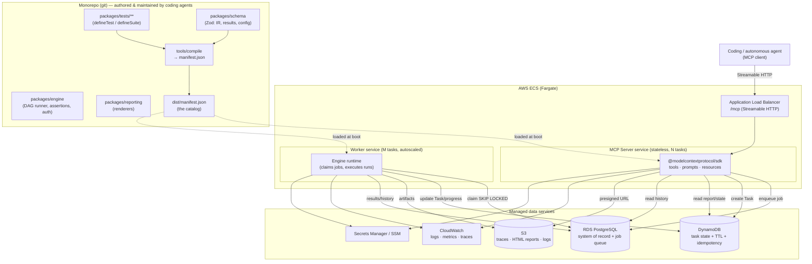
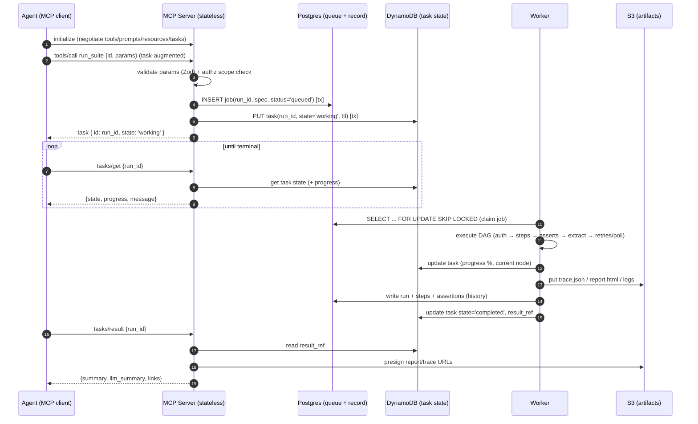
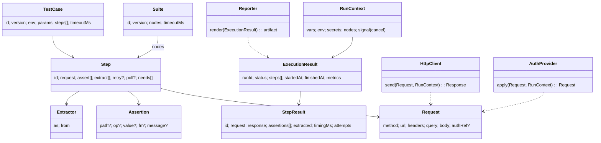
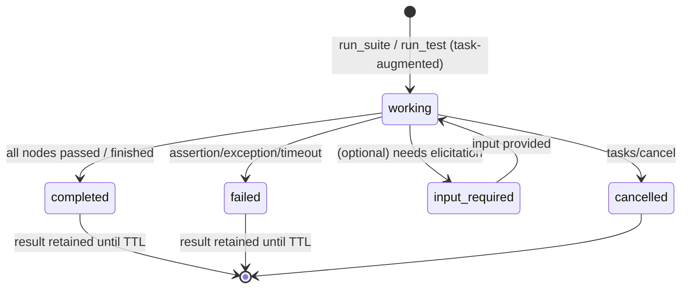
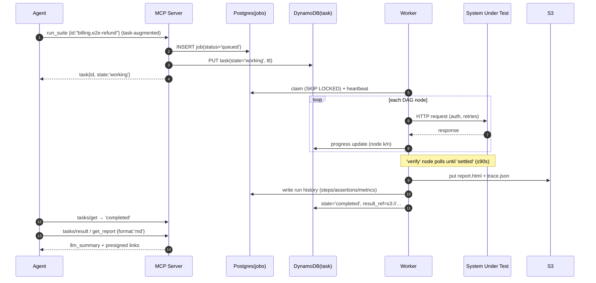
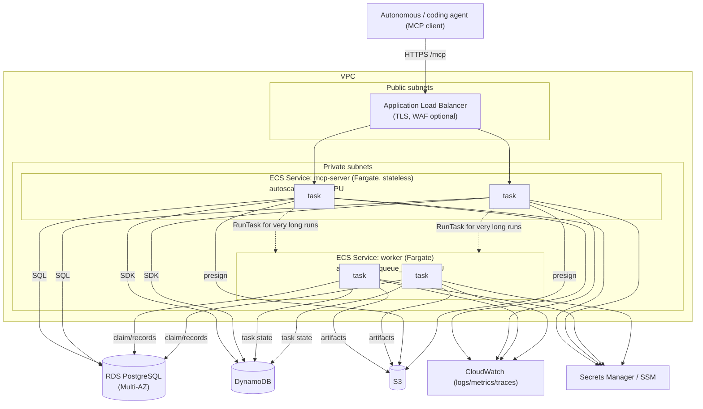
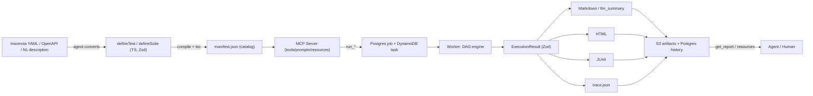

# An LLM‑Driven API Testing Platform with MCP on AWS ECS
### A production‑oriented architecture for coding‑agent‑maintained API tests

**Document status:** Architecture recommendation (implementation‑oriented)
**Target deployment:** AWS ECS (Fargate) with RDS PostgreSQL, DynamoDB, S3, CloudWatch
**Primary consumers:** Autonomous coding agents (Claude Code, Opencode, Codex, etc.) + human engineers
**Date:** July 2026

---

## Table of contents

1. [Executive summary](#1-executive-summary)
2. [Research findings](#2-research-findings)
3. [Architectural Decision Records (ADRs)](#3-architectural-decision-records-adrs)
4. [Technology comparison tables](#4-technology-comparison-tables)
5. [Recommended architecture](#5-recommended-architecture)
6. [Repository structure](#6-repository-structure)
7. [Internal test representation (the IR)](#7-internal-test-representation-the-ir)
8. [MCP server architecture](#8-mcp-server-architecture)
9. [Test discovery](#9-test-discovery)
10. [Execution engine design](#10-execution-engine-design)
11. [Long‑running execution](#11-long-running-execution)
12. [Small tests vs. suites (composition)](#12-small-tests-vs-suites-composition)
13. [Coding‑agent workflow](#13-coding-agent-workflow)
14. [Reporting](#14-reporting)
15. [Observability](#15-observability)
16. [Storage](#16-storage)
17. [Deployment architecture on AWS ECS](#17-deployment-architecture-on-aws-ecs)
18. [Scalability](#18-scalability)
19. [Migration strategy from Insomnia YAML](#19-migration-strategy-from-insomnia-yaml)
20. [Risks and tradeoffs](#20-risks-and-tradeoffs)
21. [Best practices](#21-best-practices)
22. [Final production‑ready recommendation](#22-final-production-ready-recommendation)
23. [Appendix: diagrams & references](#23-appendix-diagrams--references)

---

## 1. Executive summary

You are not building an "Insomnia runner." You are building a **test capability platform**: a git‑native repository whose tests are authored and maintained by coding agents, and an **MCP server** that exposes those tests to autonomous agents as first‑class, versioned capabilities.

The recommendation rests on four load‑bearing decisions:

1. **Intermediate representation = TypeScript‑authored, Zod‑validated "config‑as‑code" that compiles to a normalized JSON manifest.** Agents are exceptional at TypeScript; types act as guardrails and self‑documentation, and `tsc` gives instant feedback. A build step ("compile") walks the module graph, validates with Zod, and emits a single `manifest.json` — the catalog the MCP server and reporting consume. Raw Insomnia YAML is treated as a *migration source*, never a runtime format.

2. **The MCP server is thin and stable; tests are data.** A small, fixed set of tools (`list_tests`, `describe_test`, `run_test`, `run_suite`, `run_selection`, `get_run`, `cancel_run`, `get_report`, `list_runs`) plus MCP **prompts** that encode agent workflows and **resources** that expose the catalog and reports. New tests require **zero** new tools — they appear automatically through the manifest. This is the "supports future tests without architectural changes" property.

3. **Long‑running tests use the new MCP Tasks primitive (SEP‑1686) — no Redis, no SQS, no Kafka.** MCP shipped a native "call‑now, fetch‑later" async model whose canonical use cases include *test execution*. Durability is provided by **PostgreSQL as a job queue** (`SELECT … FOR UPDATE SKIP LOCKED`) plus **DynamoDB as the hot Task‑state store** (single‑digit‑ms polling reads, TTL‑based result expiry). This gives you resumability, cancellation, progress streaming, and horizontal scale using only the AWS services you already have.

4. **Transport = Streamable HTTP in stateless mode.** This is the modern MCP transport (SSE is deprecated). Stateless mode means any ECS task can serve any request behind a standard ALB — no sticky sessions, clean auto‑scaling, and it aligns with the 2026 "stateless core" direction of the protocol.

**Recommended stack (one line):** TypeScript on Node 22 LTS · `@modelcontextprotocol/sdk` (Streamable HTTP, stateless) via Hono · Zod v4 for all schemas · undici for the HTTP execution client · a lightweight in‑house DAG executor · Drizzle + RDS Postgres (system of record + job queue) · DynamoDB (task state + TTL) · S3 (artifacts) · Pino + OpenTelemetry → CloudWatch · pnpm workspaces · AWS CDK for IaC.

The rest of this document is the concrete blueprint: repository layout, the IR with code, the MCP surface, the execution engine, the long‑running flow, the agent workflows, reporting, observability, storage schema, the ECS deployment, the scalability path, and the Insomnia migration strategy.

---

## 2. Research findings

### 2.1 MCP has changed substantially — and in your favor

- **Current stable spec is `2025-11-25`**; a large release candidate, **`2026-07-28`**, is now in review. The RC delivers a *stateless protocol core* that scales on ordinary HTTP infrastructure, an *Extensions framework* (opt‑in capabilities that stabilize before entering the spec), the *Tasks* extension for long‑running work, *MCP Apps* (server‑rendered UI), authorization hardening (closer OAuth 2.1 / OIDC alignment), and a **formal deprecation policy** (≥12 months between deprecation and removal).
- **Governance matured:** MCP was donated to a Linux‑Foundation‑hosted foundation in December 2025 and is now developed through Working Groups and Spec Enhancement Proposals (SEPs) with multi‑vendor stewardship (Anthropic, OpenAI, Block). This materially de‑risks a long‑term bet on the protocol.
- **Deprecations to design around:** *Sampling* and *Roots* are deprecated as of `2026-07-28` (SEP‑2577). Guidance is to call LLM provider APIs directly from your server rather than relying on client‑side sampling. Your design should **not** depend on sampling.

**Implication:** MCP is now a stable, foundation‑governed standard with an explicit compatibility policy. Building on it for a multi‑year platform is defensible.

### 2.2 The Tasks primitive (SEP‑1686) is purpose‑built for your long‑running tests

- Tasks introduce a **generic request‑augmentation** mechanism: any supported request (currently `tools/call`, plus client‑side `sampling/createMessage` and `elicitation/create`) can be turned into a **durable task** with a task ID, queried later via `tasks/get`, `tasks/result`, `tasks/list`, and `tasks/cancel`.
- A task is a **durable state machine** with five states: `working`, `input_required`, `completed`, `failed`, `cancelled`.
- The model is **requestor‑driven** ("call now, fetch later"): the requestor decides when to create a task and how to poll; the receiver decides which requests are task‑augmentable and how long results are retained.
- **A task must outlive the HTTP/SSE request that created it** → you need a **durable task store**. The community's own framing: SEP‑1686 lets you offload the durability you'd otherwise reach for a workflow engine (e.g., Temporal) to handle, keeping the agent side a lightweight orchestrator.
- Officially listed use cases include **test execution**, data‑analysis pipelines, code migrations, and deep research. It is marked *experimental*, with known lifecycle gaps being iterated (retry‑on‑transient‑failure semantics, result‑expiry policies). Graceful degradation means older clients still work.

**Implication:** Model each long test run as an MCP Task. Persist task state durably (DynamoDB with TTL). Poll for status; stream progress via notifications. You get cancellation, resumability, and reconnection semantics from the protocol itself.

### 2.3 Transport: Streamable HTTP, stateless, single endpoint

- **SSE is deprecated** (since March 2025). **Streamable HTTP** is the production transport: a single `/mcp` endpoint that supports stateless request/response *and* optional SSE streaming per request, letting the server choose the mode per call.
- **Stateless mode** removes sticky‑session/connection‑affinity requirements → any instance handles any request behind AWS ALB; auto‑scaling is straightforward on ECS. The SDK docs explicitly recommend setting stateless mode for API‑style servers and note a "persistent storage mode" (state in a database, any node handles a session) for stateful needs.
- The `2026-07-28` RC pushes this further with a **stateless core** designed for standard load balancers and gateways.

**Implication:** Run the MCP server **stateless**. Keep *all* cross‑request state (tasks, runs) in Postgres/DynamoDB, not in instance memory. This is the single most important operational decision for ECS.

### 2.4 SDK landscape (TypeScript)

- The official **`@modelcontextprotocol/sdk`** (recent stable line ≈ `1.29.x`; a v2 package split — `@modelcontextprotocol/server`, `@modelcontextprotocol/client`, thin middleware adapters for Express/Hono/Node — is landing alongside the `2026-07-28` spec). It runs on Node.js, Bun, and Deno; ships Streamable HTTP + stdio; and includes **runnable Task examples** ("experimental task‑based execution", "task‑based execution with interactive server→client requests").
- Schemas use **Standard Schema** — bring **Zod v4** (recommended), Valibot, or ArkType. This lets you share one schema for both MCP tool inputs and your test IR.
- Auth: OAuth 2.1 support — protected‑resource metadata (RFC 9728), resource indicators (RFC 8707), scope checks inside handlers, DNS‑rebinding mitigation; validate JWTs with `jose`.
- **FastMCP 3.0** (Jan 2026) is the ergonomic *Python* path. For TypeScript, the mainstream production choice is the **official SDK + Zod**.

**Implication:** Use the official TypeScript SDK. Do not adopt a heavier abstraction that could lag the fast‑moving spec; the SDK tracks the RC directly and ships Task support you can build on.

### 2.5 Modern API‑testing landscape (what "good" looks like in 2026)

| Tool | Model | Relevance to this platform |
|---|---|---|
| **Bruno** | Git‑native plain‑text `.bru`, declarative asserts + JS, CLI runner, JUnit/HTML reports | Validates the git‑native/declarative direction; a good *optional* human GUI/interchange target. Bespoke format, weaker typing/composition than TS. |
| **Schemathesis** | Property‑based / fuzz testing from OpenAPI | Excellent *complement*: auto‑generate coverage from specs for contract/negative testing. |
| **Playwright APIRequest** | Unified E2E + API in TS | Strong TS ergonomics; heavier than needed for pure API + not designed as an introspectable catalog. |
| **Pact** | Consumer‑driven contract testing | Complement for cross‑service contracts. |
| **Karate / REST Assured / Tavern** | DSL / JVM / YAML | Mature but language‑siloed; poor fit for a TS/agent‑first codebase. |
| **k6 / Artillery** | Load testing (code‑first) | Complement for the "survives load" dimension. |
| **Keploy / Tusk Drift** | Record‑and‑replay real traffic | Interesting future source of tests; not the core representation. |

**Implication:** No off‑the‑shelf tool gives you *(typed, composable, introspectable, agent‑authorable)* tests **plus** an MCP capability surface. Build a thin IR + engine, and treat OpenAPI (Schemathesis) and contract tools (Pact) as **pluggable generators/complements**, not the foundation.

### 2.6 Intermediate‑representation options (the core decision)

| Option | Type safety | Serializable/introspectable | Dynamic logic (chaining/transforms) | Agent authorability | Verdict |
|---|---|---|---|---|---|
| Raw Insomnia YAML | ✗ | Partial | Template‑tag mini‑language | Low | Migration source only |
| Hand‑rolled YAML/JSON DSL | ✗ (schema only) | ✓ | Needs a templating sub‑language | Medium | Rejected (schema memorization, weak logic) |
| Pure imperative TS (Vitest + raw fetch) | ✓ | ✗ (opaque to server) | ✓ | High | Rejected as *the* IR (not introspectable) |
| **TS config‑as‑code → JSON manifest** | ✓ | ✓ | Declarative ops + typed escape hatches | **Highest** | **Recommended** |
| OpenAPI‑derived only | Partial | ✓ | ✗ | Medium | Complement (generate, don't author) |
| Workflow‑graph engine (Temporal/Inngest DSL) | ✓ | ✓ | ✓ | Medium | Overkill given SEP‑1686 offloads durability |

The recommended IR is detailed in [§7](#7-internal-test-representation-the-ir).

---

## 3. Architectural Decision Records (ADRs)

Each ADR is intentionally short: **context → decision → consequences**.

### ADR‑001 — Language & runtime: TypeScript on Node 22 LTS
- **Context:** Coding‑agent‑first repo; MCP's best‑supported remote‑server SDK is TypeScript; one language across IR, engine, server, and IaC lowers agent cognitive load.
- **Decision:** TypeScript (strict) on Node.js 22 LTS. Bun is an allowed optimization for local dev/CI but ECS runtime standardizes on Node LTS for operational maturity.
- **Consequences:** One toolchain; `tsc` as a correctness gate agents can run; broad library ecosystem (undici, Drizzle, Pino, OTel). Node overhead vs. Bun is negligible for an I/O‑bound test runner.

### ADR‑002 — MCP SDK & transport: official SDK, Streamable HTTP, **stateless**
- **Context:** SSE deprecated; ECS behind ALB; fast‑moving spec.
- **Decision:** `@modelcontextprotocol/sdk` with Streamable HTTP in **stateless** mode, mounted via the Hono adapter. No in‑memory cross‑request state.
- **Consequences:** Trivial horizontal scale, no sticky sessions, forward‑compatible with the 2026 stateless core. Any per‑session convenience must be reconstructed from persistent stores (acceptable — see storage design).

### ADR‑003 — Internal representation: TS config‑as‑code → normalized JSON manifest
- **Context:** Need typed, composable, introspectable, agent‑authorable tests.
- **Decision:** Author tests as typed values via `defineTest`/`defineSuite`, validated by Zod. A build‑time **compile** step emits `manifest.json` (the catalog). The manifest, not the source files, is what the server loads.
- **Consequences:** Single source of truth; instant type feedback; clean serializable contract for the server/reporting; deterministic discovery. Requires a compile step in CI (cheap, cacheable).

### ADR‑004 — Long‑running execution: **MCP Tasks + Postgres SKIP LOCKED + DynamoDB**, no Redis/SQS/Kafka
- **Context:** Some tests exceed a minute; must be resumable/cancellable/pollable on ECS; broker services unavailable.
- **Decision:** Model runs as MCP Tasks. Durable dispatch via a Postgres job table using `FOR UPDATE SKIP LOCKED`. Hot task state in DynamoDB with TTL for result expiry. Progress via task updates + MCP progress notifications; logs to CloudWatch; artifacts to S3.
- **Consequences:** Reliability and resumability with zero new infrastructure. DynamoDB absorbs high‑frequency polling cheaply; Postgres provides transactional dispatch and the system of record. (You can collapse DynamoDB into Postgres at small scale — see §18.)

### ADR‑005 — Storage split: Postgres (record + queue) · DynamoDB (task state + TTL) · S3 (artifacts)
- **Context:** Different access patterns (relational reporting vs. hot polling vs. large blobs).
- **Decision:** As above.
- **Consequences:** Each store used for its strength; pointers (not blobs) live in the databases. Slightly more moving parts than single‑store, justified beyond a few hundred runs/day.

### ADR‑006 — Reporting: one canonical typed result → many renderers
- **Context:** Humans and agents need different report shapes.
- **Decision:** The engine emits a Zod‑typed `ExecutionResult`. Renderers derive Markdown (agent‑friendly), self‑contained HTML (humans), JUnit XML (CI), and a compact `llm_summary`.
- **Consequences:** No divergence between formats; new formats are additive renderers.

### ADR‑007 — Auth: OAuth 2.1 for remote MCP; scope‑gated tools
- **Context:** Remote server, potentially multi‑tenant/multi‑agent.
- **Decision:** OAuth 2.1 (RFC 9728 metadata, RFC 8707 resource indicators), `jose` validation, `test:read` / `test:run` scopes checked in every handler. ALB may add network‑level protection.
- **Consequences:** Standards‑based, gateway‑friendly authz. For a purely internal deployment, this can be simplified to ALB + IAM/OIDC initially and hardened later.

### ADR‑008 — IaC: AWS CDK (TypeScript)
- **Context:** Same‑language infra is more agent‑maintainable.
- **Decision:** AWS CDK in TypeScript; one repo, typed stacks.
- **Consequences:** Agents can evolve infra with the same tooling; Terraform remains a valid alternative if org‑standardized.

---

## 4. Technology comparison tables

### 4.1 MCP server framework (TypeScript)

| Option | Pros | Cons | Decision |
|---|---|---|---|
| **Official `@modelcontextprotocol/sdk`** | Tracks the spec/RC directly; ships Task + Streamable HTTP + auth helpers; Standard Schema/Zod | Lower‑level than decorator frameworks | **Chosen** |
| Community FastMCP (TS) | Ergonomic helpers, stateless flag, health endpoints | Extra abstraction that can lag the RC; smaller guarantees | Optional wrapper only |
| Build on raw JSON‑RPC | Max control | Reimplements the protocol; high risk | Rejected |

### 4.2 HTTP client for executing tests

| Option | Notes | Decision |
|---|---|---|
| **undici** (`request`/`fetch`) | Node‑native, fast, fine control over timing/redirects/pooling/timeouts | **Chosen** |
| got | Ergonomic, retry/hooks built‑in | Viable alternative |
| axios | Ubiquitous | Heavier, less low‑level control |

### 4.3 Persistence / ORM

| Option | Notes | Decision |
|---|---|---|
| **Drizzle ORM** | SQL‑first, superb TypeScript types, lightweight, migration tooling; agent‑readable queries | **Chosen (Postgres)** |
| Prisma | Great DX, mature | Heavier runtime/codegen; still viable |
| AWS SDK v3 (DynamoDB DocumentClient) | Direct, typed enough | **Chosen (DynamoDB)** |

### 4.4 Workflow / durability

| Option | Notes | Decision |
|---|---|---|
| **In‑house DAG runner + MCP Tasks + Postgres queue** | No new infra; durability handled by Task store + SKIP LOCKED | **Chosen** |
| Temporal | Best‑in‑class durable workflows | Requires a cluster/service; unnecessary given SEP‑1686 | Future option at large scale |
| Inngest / Restate | Durable execution as a service/SDK | External dependency; revisit if DAGs grow very complex | Future option |

### 4.5 Observability

| Concern | Choice |
|---|---|
| Logging | **Pino** (structured JSON) → stdout → CloudWatch Logs (awslogs) |
| Metrics | **CloudWatch EMF** or OTel metrics (pass rate, p50/p95 run duration, queue depth, worker utilization) |
| Tracing | **OpenTelemetry** → AWS X‑Ray / CloudWatch (span per run, per HTTP call) |
| History/audit | **Postgres** (runs, steps, assertions, audit log) |

### 4.6 Supporting choices

| Concern | Choice | Why |
|---|---|---|
| Validation | **Zod v4** | One schema for MCP tool inputs + IR + config; `z.infer` types |
| Web adapter | **Hono** | Fast, modern, first‑class MCP middleware; edge‑portable |
| Monorepo | **pnpm workspaces** | Content‑addressed store, strict, fast; clean package boundaries |
| Bundling | **tsup/esbuild** | Fast, minimal config |
| Unit tests (of the platform) | **Vitest** | Fast, TS‑native |
| Config | **Zod‑validated env** at boot (fail fast); Secrets Manager/SSM for secrets | Deterministic, safe |
| DI | **Manual composition root** (+ optional `awilix`) | Less "magic" for agents to trace |
| IaC | **AWS CDK (TS)** | Same language as app |

---

## 5. Recommended architecture

### 5.1 One‑paragraph shape

A pnpm monorepo holds the **test definitions** (TS config‑as‑code), a **shared schema** package (Zod), an **execution engine** package, a **reporting** package, and an **MCP server** package. A `compile` step turns definitions into `manifest.json`. The MCP server (stateless, Streamable HTTP) loads the manifest and exposes a small, fixed tool/prompt/resource surface. Long runs become MCP **Tasks**; the server enqueues a job in **Postgres** and writes task state to **DynamoDB**; a **worker** service claims jobs (`SKIP LOCKED`), runs the engine, streams progress, writes artifacts to **S3**, results to **Postgres**, and flips the task to `completed`. Agents poll `tasks/get`, then fetch `get_report`. Everything is observable through **Pino + OTel → CloudWatch**.

### 5.2 Component diagram



---

## 6. Repository structure

Design goals: agents can add/refactor tests trivially; the tree stays clean at thousands of tests; reuse is structurally encouraged; discovery is deterministic.

```
api-testing-platform/
├─ CLAUDE.md                     # ← the contract for coding agents (read this first)
├─ README.md
├─ pnpm-workspace.yaml
├─ turbo.json                    # (optional) task caching
├─ tsconfig.base.json
│
├─ packages/
│  ├─ schema/                    # Zod schemas = the single source of truth
│  │  ├─ src/
│  │  │  ├─ test.ts              # TestCase, Step, Assertion, Extractor, Retry, ...
│  │  │  ├─ suite.ts             # Suite, dependency edges
│  │  │  ├─ result.ts            # ExecutionResult, StepResult, AssertionResult
│  │  │  ├─ manifest.ts          # Manifest (catalog) schema
│  │  │  └─ config.ts            # Env/config schema
│  │  └─ package.json
│  │
│  ├─ engine/                    # Reusable execution engine (pure, no MCP/AWS deps)
│  │  ├─ src/
│  │  │  ├─ define.ts            # defineTest / defineSuite / defineEnv / defineAuth
│  │  │  ├─ runner.ts            # single test + suite (DAG) execution
│  │  │  ├─ graph.ts             # topological sort, dependency resolution
│  │  │  ├─ http.ts              # undici client wrapper (timing, redirects, pooling)
│  │  │  ├─ assertions.ts        # declarative operators + escape-hatch fns
│  │  │  ├─ extract.ts           # JSONPath/header/status extraction → var bag
│  │  │  ├─ variables.ts         # scoped variable substitution
│  │  │  ├─ auth/                # bearer, oauth2-cc, basic, api-key, custom
│  │  │  ├─ retry.ts             # retry/backoff policy
│  │  │  └─ redact.ts            # secret redaction for traces
│  │  └─ package.json
│  │
│  ├─ reporting/                 # Canonical result → Markdown/HTML/JUnit/llm_summary
│  │  └─ src/{markdown,html,junit,summary}.ts
│  │
│  ├─ store/                     # Persistence adapters (Postgres, DynamoDB, S3)
│  │  ├─ src/
│  │  │  ├─ db/                  # Drizzle schema + migrations + queue (SKIP LOCKED)
│  │  │  ├─ tasks.ts             # DynamoDB task store (get/put/update/TTL)
│  │  │  └─ artifacts.ts         # S3 put/get + presigned URLs
│  │  └─ package.json
│  │
│  ├─ mcp-server/                # The MCP server (stateless) + worker entrypoint
│  │  ├─ src/
│  │  │  ├─ server.ts            # McpServer wiring, Streamable HTTP (stateless)
│  │  │  ├─ tools/               # one file per tool (list_tests, run_suite, ...)
│  │  │  ├─ prompts/             # import_insomnia, author_test, triage_failure, ...
│  │  │  ├─ resources/           # test://catalog, run://{id}/report.md, ...
│  │  │  ├─ tasks.ts             # Task lifecycle glue (SEP-1686)
│  │  │  ├─ worker.ts            # job claimer → engine → result/artifacts
│  │  │  └─ auth.ts              # OAuth2.1 verification, scope checks
│  │  └─ package.json
│  │
│  └─ cli/                       # local DX: `atp run <id>`, `atp compile`, `atp import`
│
├─ tests/                        # ← the test corpus (grows to thousands)
│  ├─ _shared/                   # reusable building blocks (NO duplication lives here)
│  │  ├─ env/{staging,prod,local}.ts
│  │  ├─ auth/{service-a,partner-x}.ts
│  │  ├─ fixtures/               # payload builders, factories
│  │  └─ steps/                  # reusable steps (e.g., login, create-order)
│  ├─ billing/                   # domain namespace (folder == tag)
│  │  ├─ get-invoice.test.ts
│  │  ├─ refund.test.ts
│  │  └─ end-to-end-refund.suite.ts
│  ├─ identity/
│  │  ├─ login.test.ts           # standalone AND reused by suites
│  │  └─ oauth-flow.suite.ts
│  └─ ...                        # partition by domain/team; codeowners per folder
│
├─ tools/
│  └─ compile/                   # discovery: import all *.test.ts/*.suite.ts → manifest.json
│
├─ infra/                        # AWS CDK (TypeScript)
│  └─ lib/{network,ecs,data,observability}-stack.ts
│
├─ dist/manifest.json            # generated catalog (committed or built in CI)
├─ CODEOWNERS
└─ .github/workflows/            # compile + typecheck + lint + (optional) smoke run
```

**Why this stays clean at scale:**
- **Folder = tag = ownership.** New domains are new folders with a `CODEOWNERS` entry. The manifest partitions by namespace, so `list_tests` filters cheaply.
- **Reuse is structural.** Shared env/auth/steps/fixtures live in `tests/_shared`; suites import them. Duplication has nowhere to hide.
- **One convention.** Every executable test is `*.test.ts`; every composition is `*.suite.ts`. Discovery never guesses.
- **`CLAUDE.md` is the contract.** It documents the conventions, the `defineTest` API, the "add a test" recipe, and the migration recipe — this is what makes agents productive with minimal prompting.

---

## 7. Internal test representation (the IR)

**Decision:** Author in TypeScript as typed, declarative values; validate with Zod; compile to a normalized JSON manifest. Fields are declarative for the common case (so they serialize and stay introspectable), with **typed function escape hatches** for genuinely dynamic logic.

### 7.1 A standalone test

```ts
// tests/identity/login.test.ts
import { defineTest } from "@atp/engine";
import { staging } from "../_shared/env/staging";

export default defineTest({
  id: "identity.login",            // stable, globally unique
  version: 1,
  title: "User can log in and receive a token",
  tags: ["identity", "auth", "smoke"],
  owner: "team-identity",
  timeoutMs: 15_000,
  env: staging,
  // Parameters are a Zod schema → the MCP tool input schema is derived from this
  params: (z) => z.object({
    email: z.string().email().default("qa@example.com"),
    password: z.string().default("{{secrets.QA_PASSWORD}}"),
  }),
  steps: [
    {
      id: "post-login",
      request: {
        method: "POST",
        url: "{{env.baseUrl}}/auth/login",
        headers: { "content-type": "application/json" },
        body: { email: "{{params.email}}", password: "{{params.password}}" },
      },
      assert: [
        { path: "status", op: "eq", value: 200 },
        { path: "body.token", op: "isString" },
        { path: "headers.content-type", op: "contains", value: "application/json" },
        // Escape hatch: typed predicate for logic operators can't express
        { fn: (res) => res.body.expiresIn > 0, message: "token must not be expired" },
      ],
      extract: [
        { as: "authToken", from: "body.token" },       // published to the scoped var bag
        { as: "userId", from: "body.user.id" },
      ],
      retry: { max: 2, backoffMs: 500, on: ["network", "5xx"] },
    },
  ],
});
```

### 7.2 A suite that composes existing tests (no duplication)

```ts
// tests/billing/end-to-end-refund.suite.ts
import { defineSuite, useTest, useStep } from "@atp/engine";
import login from "../identity/login.test";
import { createOrder } from "../_shared/steps/create-order";

export default defineSuite({
  id: "billing.e2e-refund",
  version: 3,
  title: "Create order → capture → refund → verify ledger",
  tags: ["billing", "e2e"],
  owner: "team-billing",
  timeoutMs: 120_000,             // long-running: becomes an MCP Task
  // A suite is a DAG of nodes; each node is a reused test, a reused step, or inline
  nodes: {
    auth:   useTest(login, { params: { email: "billing-bot@example.com" } }),
    order:  useStep(createOrder, { needs: ["auth"], with: { token: "{{nodes.auth.authToken}}" } }),
    capture:{ needs: ["order"], request: { method: "POST", url: "{{env.baseUrl}}/payments/{{nodes.order.paymentId}}/capture" },
              assert: [{ path: "status", op: "eq", value: 200 }] },
    refund: { needs: ["capture"], request: { method: "POST", url: "{{env.baseUrl}}/payments/{{nodes.order.paymentId}}/refund" },
              assert: [{ path: "status", op: "eq", value: 202 }],
              extract: [{ as: "refundId", from: "body.id" }] },
    verify: { needs: ["refund"], request: { method: "GET", url: "{{env.baseUrl}}/ledger/refunds/{{nodes.refund.refundId}}" },
              assert: [{ path: "body.status", op: "eq", value: "settled" }],
              // Long/eventual: poll until settled or timeout
              poll: { untilAssertPasses: true, intervalMs: 3000, maxMs: 90_000 } },
  },
});
```

Key properties this gives you:
- **`login.test.ts` is independently runnable** *and* reused by the suite — one definition, two consumers.
- **Chaining** is explicit: `extract` publishes values; later nodes reference `{{nodes.X.var}}`.
- **Dependencies** are explicit (`needs`) → the engine topologically sorts and can parallelize independent branches.
- **Parameterization**: `params` is a Zod schema, so the derived MCP tool input schema is correct and self‑documenting; a suite can override a reused test's params.
- **Long/eventual steps**: `poll` handles "retry the assertion until it passes" without special‑casing the whole run.

### 7.3 Parameterized execution against multiple URLs / matrices

```ts
export default defineTest({
  id: "identity.login.matrix",
  matrix: {                                  // cartesian expansion at compile/plan time
    region: ["us", "eu", "ap"],
    tier: ["free", "pro"],
  },
  env: (m) => envForRegion(m.region),        // env derived from the matrix cell
  // ... steps reference {{matrix.region}} / {{matrix.tier}}
});
```

Each matrix cell is a discrete executable unit in the manifest (so agents can run one cell or all), while remaining one authored file.

### 7.4 The normalized manifest (what the server actually loads)

The `compile` step emits a validated catalog. It contains **no executable functions** — escape‑hatch predicates are referenced by a stable content hash and executed only in the engine runtime, keeping the manifest a pure, portable, introspectable JSON contract.

```jsonc
{
  "schemaVersion": "1.0",
  "gitSha": "…",
  "manifestHash": "…",            // reproducibility: runs record which manifest they used
  "entries": [
    {
      "id": "billing.e2e-refund",
      "kind": "suite",
      "version": 3,
      "title": "Create order → capture → refund → verify ledger",
      "tags": ["billing", "e2e"],
      "owner": "team-billing",
      "timeoutMs": 120000,
      "isLongRunning": true,       // drives Task augmentation by default
      "paramsSchema": { /* JSON Schema derived from Zod */ },
      "nodes": [ /* normalized DAG: ids, needs, request templates, assertions, extracts */ ],
      "sourcePath": "tests/billing/end-to-end-refund.suite.ts"
    }
    /* … thousands of entries … */
  ]
}
```

**Tradeoffs, stated plainly:**
- *Pro:* types + IDE + `tsc` gate; serializable/introspectable; one source of truth; deterministic discovery; escape hatches without losing the declarative core.
- *Con:* requires a compile step (mitigated by caching and CI); escape‑hatch predicates aren't portable to non‑TS runtimes (acceptable — the platform is TS).

---

## 8. MCP server architecture

### 8.1 Capabilities

Advertise: `tools`, `prompts`, `resources`, and the **`tasks`** extension (SEP‑1686). Do **not** rely on sampling/roots (deprecated). Run **stateless** Streamable HTTP.

### 8.2 Tools (small, fixed — new tests need none of them changed)

| Tool | Input (Zod) | Task‑augmented? | Returns |
|---|---|---|---|
| `list_tests` | `{ tags?, owner?, kind?, query? }` | no | catalog entries (id, title, tags, params schema, isLongRunning) |
| `describe_test` | `{ id }` | no | full normalized definition + example invocation |
| `run_test` | `{ id, params?, env? }` | **auto** if `isLongRunning` (client may force) | inline result (fast) **or** task id |
| `run_suite` | `{ id, params?, env? }` | **yes** by default | task id |
| `run_selection` | `{ tags?/query, params? }` | yes | task id (batch run) |
| `get_run` | `{ runId }` | mirrors `tasks/get` | status + progress + summary |
| `get_run_result` | `{ runId, format? }` | mirrors `tasks/result` | result + resource links |
| `cancel_run` | `{ runId }` | mirrors `tasks/cancel` | ack |
| `get_report` | `{ runId, format: md\|html\|junit\|json }` | no | inline (md/summary) or S3 presigned URL (html/json) |
| `list_runs` | `{ testId?, since?, status?, limit? }` | no | history from Postgres (trends, flakiness) |

> The `run_*` tools and the `tasks/*` methods overlap deliberately: agents that speak the Tasks extension use `tasks/get|result|cancel`; the `get_run|get_run_result|cancel_run` tools give the *same* semantics to clients that don't yet implement the extension (graceful degradation).

### 8.3 Prompts (encode the agent workflows so behavior is reusable, not re‑prompted)

- `import_insomnia_collection` — given a path/paste of Insomnia YAML, produce `defineTest`/`defineSuite` modules following repo conventions + a golden‑master assertion plan.
- `author_new_test` — scaffold a new test from a natural‑language description or an OpenAPI operation.
- `triage_failure` — given a failed `runId`, fetch the report + trace, hypothesize root cause, propose a fix or a quarantine.
- `generate_suite` — compose existing tests into a new suite (reuse first; forbid duplication).
- `regenerate_reports` — re‑render historical runs into a new format.

### 8.4 Resources (read‑only, introspectable)

- `test://catalog` → the manifest (or a filtered view).
- `test://{id}` → one normalized definition.
- `run://{runId}/report.md` and `run://{runId}/trace.json` → via resource templates (backed by S3 presigned reads).

### 8.5 Execution flow & lifecycle



### 8.6 Versioning & extensibility

- **Protocol:** SDK negotiates `2025-11-25` (stable) and adopts `2026-07-28` extensions as they stabilize; the formal deprecation policy protects you for ≥12 months on any change.
- **Tests:** each entry has `id` + `version`; runs persist `manifestHash` + `gitSha` for exact reproducibility.
- **Tools:** evolve **additively** (new optional fields, new tools). Never rename/remove a tool without a deprecation window. Because tests are *data*, the tool surface almost never changes — which is the whole point.

---

## 9. Test discovery

**Mechanism:** filesystem convention + build‑time compile → `manifest.json`; the server/worker load the manifest at boot (with optional hot‑reload in dev).

Why not runtime filesystem scanning or decorators‑at‑import?
- **Determinism & speed:** the server doesn't scan on every request; it reads one validated catalog.
- **Validation gate:** compile runs Zod + `tsc`; a malformed test fails CI, never reaching production.
- **Introspection:** the manifest *is* the API contract for `list_tests`/resources.

The compile step (sketch):

```ts
// tools/compile/index.ts
import { glob } from "glob";
import { pathToFileURL } from "node:url";
import { ManifestSchema, normalize } from "@atp/schema";

const files = await glob("tests/**/*.{test,suite}.ts");
const entries = [];
for (const f of files) {
  const mod = await import(pathToFileURL(f).href);
  entries.push(normalize(mod.default, f));      // validates via Zod, throws on error
}
const manifest = ManifestSchema.parse({ schemaVersion: "1.0", gitSha, entries });
await writeFile("dist/manifest.json", JSON.stringify(manifest));
```

**Adding a test = drop a `*.test.ts` file that follows the convention.** CI compiles + typechecks; the new test is instantly discoverable. No registration, no plugin wiring, no server change. This is the "extremely simple to add tests" requirement, satisfied structurally.

---

## 10. Execution engine design

The engine is a **pure package** (no MCP, no AWS) so it's testable and reusable from the CLI, CI, and the worker.

### 10.1 Core module/type diagram



### 10.2 What the engine supports

- **Single test / suite / parameterized / chained** — one runner over a normalized DAG; a single test is a one‑node DAG.
- **Dynamic variables & substitution** — `{{env.*}}`, `{{params.*}}`, `{{secrets.*}}`, `{{nodes.X.var}}`, `{{matrix.*}}` resolved against a scoped `RunContext`.
- **Dependency graph** — topological sort; independent branches run concurrently (bounded parallelism).
- **Retries** — per‑step policy (`max`, `backoffMs`, `on: [network|4xx|5xx|assertion]`).
- **Polling / eventual consistency** — `poll.untilAssertPasses` for "verify until settled."
- **Assertions** — declarative operators (`eq`, `neq`, `gt`, `lt`, `contains`, `matches`, `isString`, `isNumber`, `jsonSchema`, `jsonpath`) **plus** typed `fn` escape hatches. Response‑shape validation can use a Zod/JSON‑Schema operator.
- **Authentication** — pluggable providers: `bearer`, `basic`, `api-key`, `oauth2-client-credentials` (with token caching per run), `custom`. Auth is a *reusable building block* in `tests/_shared/auth`.
- **Environments** — typed env objects; the same test runs against staging/prod/local by swapping `env`.
- **Secret redaction** — traces pass through `redact()` before persistence so tokens/PII never land in S3/Postgres.

### 10.3 Runner (essence)

```ts
export async function runNode(node: Node, ctx: RunContext): Promise<StepResult> {
  return withRetry(node.retry, async () => {
    const req = await applyAuth(resolveTemplates(node.request, ctx), ctx);
    const started = performance.now();
    const res = await http.send(req, ctx.signal);          // undici, cancellable
    const timingMs = performance.now() - started;
    const assertions = evaluate(node.assert, res, ctx);    // declarative + fn
    if (node.poll?.untilAssertPasses && assertions.some(a => !a.ok)) {
      return retryPollUntil(node, ctx);                    // eventual consistency
    }
    const extracted = extract(node.extract, res);          // publish to ctx.vars/nodes
    Object.assign(ctx.nodes[node.id] ??= {}, extracted);
    return { id: node.id, request: redact(req), response: redact(res), assertions, extracted, timingMs };
  });
}
```

The suite runner resolves the DAG and awaits dependencies before scheduling each node, checking `ctx.signal` between nodes for cooperative cancellation.

---

## 11. Long‑running execution

This is where MCP's new **Tasks** primitive does the heavy lifting, and where you avoid Redis/RabbitMQ/Kafka entirely.

### 11.1 The task state machine (SEP‑1686)



### 11.2 The no‑broker durability pattern

**Dispatch (durable):** Postgres job table with `FOR UPDATE SKIP LOCKED` — a battle‑tested queue that needs no extra infra and is transactional with your writes.

```sql
-- worker claims exactly one job, safely across many workers
UPDATE jobs
SET status = 'running', worker_id = $1, claimed_at = now()
WHERE id = (
  SELECT id FROM jobs
  WHERE status = 'queued' AND run_after <= now()
  ORDER BY priority DESC, created_at
  FOR UPDATE SKIP LOCKED
  LIMIT 1
)
RETURNING *;
```

**Hot state (fast polling):** DynamoDB item per run — `state`, `progressPct`, `currentNode`, `resultRef`, and a **TTL** attribute implementing SEP‑1686's "results retained for a server‑defined duration." Polling `tasks/get` hits DynamoDB (single‑digit‑ms, cheap at high volume) instead of hammering Postgres.

**Progress & logs:** the worker updates the DynamoDB item and emits MCP **progress notifications**; step logs stream to CloudWatch (awslogs); large artifacts go to S3.

**Cancellation:** `tasks/cancel` sets a cancel flag (DynamoDB + a `jobs.cancel_requested` column); the worker checks it between nodes and aborts the in‑flight undici request via `AbortSignal`.

**Resumability & crash‑safety:** if a worker dies mid‑run, its job's `claimed_at` goes stale; a reaper requeues jobs whose lease expired (heartbeat pattern). The client keeps polling the same task id across reconnects — the Task outlives any single HTTP request or worker instance.

**Timeout management:** three layers — per‑step `timeoutMs` (undici), per‑run `timeoutMs` (suite), and a global worker lease. ALB idle timeout is irrelevant because the run happens in the **worker**, and the client only makes short polling calls.

### 11.3 Where the run actually executes on ECS

Two supported modes (choose per workload; both need no broker):

1. **Persistent worker pool (default):** a separate ECS **worker service** long‑polls the Postgres queue and runs the engine. Autoscale on **queue depth** (a CloudWatch custom metric) and CPU. Best for many short/medium runs.
2. **On‑demand isolated task (for very long / heavy / noisy‑neighbor‑sensitive runs):** the MCP service calls **ECS `RunTask`** to launch a one‑off Fargate task that executes a single run and exits. Fargate tasks can run for a long time, giving strong isolation and clean per‑run resource limits.

### 11.4 End‑to‑end long‑running flow



---

## 12. Small tests vs. suites (composition)

The composition rules that keep the corpus DRY and every unit independently runnable:

- **Every `*.test.ts` is a first‑class executable** — the engine runs a one‑node (or matrix) DAG. `run_test` works on it directly.
- **Suites reference, never copy.** `useTest(login, {...})` and `useStep(createOrder, {...})` embed existing definitions by reference; overrides (params/env) are explicit and local.
- **Reusable primitives live once** in `tests/_shared` (`env`, `auth`, `steps`, `fixtures`). If two suites need "log in," they both `useTest(login)` — there is exactly one login definition.
- **Dependency management is data.** `needs` edges are validated at compile time (cycle detection); the manifest carries the normalized DAG so the server can show agents exactly what a suite depends on.
- **Independent execution + composition coexist** because a suite node is just *a reference to a runnable plus wiring*, not a re‑implementation.

Result: adding a suite is "pick existing tests, declare the edges, add the 1–2 novel steps." Duplication is structurally discouraged and cycle‑checked.

---

## 13. Coding‑agent workflow

The repository is optimized for autonomous agents. The two artifacts that make this work are **`CLAUDE.md`** (conventions + recipes) and the MCP **prompts** (reusable procedures).

### 13.1 Import an Insomnia collection

```mermaid
sequenceDiagram
  autonumber
  participant Ag as Coding Agent
  participant FS as Repo (files)
  participant CI as compile + tsc

  Ag->>FS: read CLAUDE.md (conventions, defineTest API, mapping table)
  Ag->>FS: read insomnia/*.yaml (requests, groups, envs, auth, chained refs)
  Ag->>FS: write tests/<domain>/<name>.test.ts (defineTest)
  Ag->>FS: write tests/<domain>/<name>.suite.ts for request groups (defineSuite)
  Ag->>FS: reuse tests/_shared/{env,auth,steps} (no duplication)
  Ag->>CI: run `atp compile` + `tsc` (validation gate)
  CI-->>Ag: errors? → fix; else manifest.json updated
  Ag->>FS: (golden master) capture baseline once, add assertions to prove parity
```

**Insomnia → IR mapping the agent follows:**

| Insomnia concept | IR target |
|---|---|
| Request | a `step` (method/url/headers/body) |
| Request group / folder | a `suite` (`defineSuite`) and/or a tag namespace |
| Environment / sub‑env | `tests/_shared/env/*.ts` (typed env object) |
| Template tags / response refs (chaining) | `extract` + `{{nodes.X.var}}` references |
| Auth (bearer/basic/oauth2) | a provider in `tests/_shared/auth/*.ts` |
| Variables | `params` (Zod) or `env`/`secrets` |

### 13.2 Other core workflows (each backed by an MCP prompt)

- **Create a new test:** from a description or an OpenAPI operation → `author_new_test` scaffolds `defineTest`, agent fills specifics, compiles.
- **Edit an existing test:** open the `*.test.ts`, change declaratively, `tsc` + compile catch regressions.
- **Generate a suite:** `generate_suite` enforces "reuse existing tests first"; agent declares the DAG.
- **Fix failures:** `triage_failure` → agent calls `get_report`/reads `run://{id}/trace.json`, forms a hypothesis, edits the test or the SUT ticket, re‑runs `run_test`.
- **Regenerate reports:** `regenerate_reports` re‑renders stored `ExecutionResult`s into a new format.

Because the tool surface is fixed and tests are data, agents spend their effort on **content** (the tests), not on wiring — which is exactly what makes this scale to a managed agent ecosystem.

---

## 14. Reporting

**One canonical, Zod‑typed `ExecutionResult` → many renderers.** No format drifts from another.

- **Markdown** (`report.md`) — agent‑friendly: status, per‑node pass/fail, assertion table, timing, failure diagnostics. Returned inline by `get_report`.
- **`llm_summary`** — a compact, token‑efficient synopsis (what ran, what failed, likely cause, next action) designed for autonomous agents to act on without reading the full trace.
- **HTML** (`report.html`) — self‑contained (inlined CSS/JS), for humans: execution timeline, expandable request/response traces (redacted), logs, diffs.
- **JUnit XML** — drops straight into CI dashboards.
- **Structured JSON** (`trace.json`) — full fidelity (request/response, headers, timings, assertions, extracted vars) for programmatic analysis; stored in S3, pointer in Postgres.

Report contents include: execution timeline, assertion summary, request/response traces, per‑step logs, failure diagnostics with heuristic "likely cause" (e.g., auth 401 vs. schema mismatch vs. timeout), and (if you later add browser steps) screenshots. Reports are addressable as MCP resources (`run://{id}/report.md`), so both humans and agents consume them the same way.

---

## 15. Observability

| Layer | Implementation |
|---|---|
| **Logs** | Pino structured JSON → stdout → **CloudWatch Logs** via the ECS `awslogs` driver. Every line carries `runId`, `taskId`, `traceId`, `nodeId`. |
| **Metrics** | **CloudWatch EMF** (or OTel metrics): `runs_total`, `pass_rate`, `run_duration_p50/p95`, `queue_depth`, `worker_utilization`, `assertion_failures_total{test}`. `queue_depth` drives worker autoscaling. |
| **Tracing** | **OpenTelemetry** → **X‑Ray / CloudWatch**: a span per run, child spans per HTTP call (URL, status, latency). Correlate agent → server → worker → SUT. |
| **Execution history** | **Postgres**: `runs`, `steps`, `assertions` — queryable for trends and **flakiness detection** (`list_runs` surfaces flaky tests). |
| **Audit log** | **Postgres**: who/what invoked which run with which params and scopes (fed by the OAuth identity). |

Thread a single **correlation id** (the `runId`) from the MCP call through the queue, the worker, the SUT calls, the artifacts, and the report. This is what makes agent‑initiated runs debuggable end‑to‑end.

---

## 16. Storage

Principled split by access pattern; blobs never live in the databases (only pointers).

### 16.1 PostgreSQL (RDS) — system of record + job queue

```sql
-- registry snapshot (per manifest hash) for reproducibility & reporting joins
CREATE TABLE manifests (hash text PRIMARY KEY, git_sha text, created_at timestamptz);
CREATE TABLE catalog_entries (manifest_hash text, id text, kind text, version int,
  tags text[], owner text, is_long_running bool, PRIMARY KEY (manifest_hash, id));

-- durable job queue (SKIP LOCKED)
CREATE TABLE jobs (id uuid PRIMARY KEY, run_id uuid, spec jsonb, priority int DEFAULT 0,
  status text, worker_id text, run_after timestamptz DEFAULT now(),
  claimed_at timestamptz, cancel_requested bool DEFAULT false, created_at timestamptz DEFAULT now());
CREATE INDEX ON jobs (status, run_after);

-- run history (the record)
CREATE TABLE runs (id uuid PRIMARY KEY, entry_id text, manifest_hash text, status text,
  params jsonb, env text, started_at timestamptz, finished_at timestamptz,
  duration_ms int, artifact_s3 text, invoked_by text);
CREATE TABLE step_results (run_id uuid, node_id text, status text, timing_ms int, attempts int,
  PRIMARY KEY (run_id, node_id));
CREATE TABLE assertion_results (run_id uuid, node_id text, idx int, ok bool, message text,
  PRIMARY KEY (run_id, node_id, idx));

CREATE TABLE audit_log (id bigserial PRIMARY KEY, at timestamptz DEFAULT now(),
  principal text, action text, entry_id text, params jsonb, scopes text[]);
```

### 16.2 DynamoDB — hot task state + TTL + idempotency

```
Table: tasks
  PK: run_id (S)
  attrs: state (working|input_required|completed|failed|cancelled),
         progress_pct (N), current_node (S), result_ref (S), error (S),
         cancel_requested (BOOL), ttl (N)   ← DynamoDB TTL implements result expiry
Table: idempotency
  PK: idem_key (S) → run_id (S), ttl (N)     ← dedupe repeated run requests
```

### 16.3 S3 — artifacts

```
s3://atp-artifacts/{env}/{yyyy}/{mm}/{dd}/{run_id}/
    trace.json      (full request/response, redacted)
    report.html     (self-contained)
    report.md
    logs.ndjson
    screenshots/…   (if browser steps added later)
```

Lifecycle policy: transition to Infrequent Access after 30 days, expire per retention policy. Serve to agents/humans via **presigned URLs** from `get_report`/resources.

**Rule of thumb:** *record and query* in Postgres, *poll* against DynamoDB, *store big things* in S3.

---

## 17. Deployment architecture on AWS ECS

### 17.1 Deployment diagram



### 17.2 Key deployment properties

- **Stateless MCP service** behind ALB → target‑tracking autoscaling on request count/CPU; rolling deploys with connection draining are safe (no session pinning).
- **Separate worker service** so long runs never block the request path; scales independently on **queue depth**.
- **Health checks:** ALB → `/healthz` (liveness) and `/readyz` (reports stateless mode + dependency reachability). `tini`/proper signal handling in the container for graceful shutdown (finish/park in‑flight work, release job leases).
- **Least‑privilege IAM task roles:** MCP role (read/write DynamoDB, read Postgres, presign S3, `ecs:RunTask` optional); worker role (claim/write Postgres, write DynamoDB/S3). Secrets via Secrets Manager injected at task start.
- **Networking:** tasks in private subnets; egress to the systems‑under‑test via NAT/VPC endpoints; DynamoDB/S3 via **Gateway VPC Endpoints** (no NAT cost, private).
- **IaC:** AWS **CDK** stacks — `network`, `data` (RDS/DynamoDB/S3), `ecs` (services + autoscaling), `observability` (dashboards/alarms).

### 17.3 CDK sketch (essence)

```ts
const cluster = new ecs.Cluster(this, "Atp", { vpc });

const mcp = new ecsp.ApplicationLoadBalancedFargateService(this, "McpServer", {
  cluster, cpu: 512, memoryLimitMiB: 1024, desiredCount: 2,
  taskImageOptions: { image, containerPort: 3000, environment: { MODE: "server" }, secrets },
});
mcp.service.autoScaleTaskCount({ maxCapacity: 20 })
  .scaleOnRequestCount("Rps", { requestsPerTarget: 200, targetGroup: mcp.targetGroup });

const worker = new ecs.FargateService(this, "Worker", {
  cluster, desiredCount: 2,
  taskDefinition: workerTaskDef,   // MODE=worker; long-poll queue
});
worker.autoScaleTaskCount({ maxCapacity: 50 })
  .scaleOnMetric("QueueDepth", { metric: queueDepthMetric, scalingSteps: [
    { upper: 0, change: -1 }, { lower: 20, change: +2 }, { lower: 100, change: +5 },
  ]});
```

---

## 18. Scalability

The architecture is designed to move along this curve **without structural change** — only configuration and partitioning.

| Stage | Corpus | What you run | Notes |
|---|---|---|---|
| **Dozens** | 10s of tests | Single MCP service task; **Postgres only** (jobs + task state + record); manifest in memory | Collapse DynamoDB into a Postgres `tasks` table to minimize moving parts. S3 for artifacts. |
| **Hundreds** | 100s | Separate **worker** service; **add DynamoDB** for polling + TTL; autoscale workers on queue depth | Add a read replica if reporting queries compete with writes. |
| **Thousands** | 1000s+ | Partition the **manifest by domain/team**; shard workers by tag/priority; precompute trend aggregates; use **`RunTask`** for the longest runs; cache `test://catalog` resources | Manifest stays clean via folder/tag partitioning + CODEOWNERS. Duplication is cycle‑checked at compile. |

Why it doesn't rot:
- **Tests are data + folders.** Growth is "more files in more namespaces," and `list_tests` filters by tag/owner — the tool surface is constant.
- **Reuse is structural.** Shared primitives prevent the copy‑paste explosion that usually kills large test suites.
- **The server is stateless.** Throughput scales by adding tasks; there's no session state to shard.
- **Durability is already externalized.** The queue and task store are managed AWS services; you scale them, not rewrite them.

---

## 19. Migration strategy from Insomnia YAML

Treat Insomnia YAML as a **source**, converted by coding agents into the IR — never wired directly into MCP.

**Phased plan:**

1. **Inventory & namespace.** Enumerate Insomnia workspaces/folders → map to `tests/<domain>` namespaces and `CODEOWNERS`.
2. **Scaffold primitives first.** Convert environments → `tests/_shared/env/*`, auth → `tests/_shared/auth/*`, common requests → `tests/_shared/steps/*`. This maximizes reuse before individual tests are written.
3. **Agent‑convert, folder by folder.** Use the `import_insomnia_collection` prompt. Each request → a `defineTest` step; each request group → a `defineSuite`; chained response references → `extract` + `{{nodes.X.var}}`.
4. **Golden‑master parity (regression safety).** Run each original request once (via Insomnia's CLI, **Inso**) to capture a baseline response; the migrated test asserts it reproduces the baseline (status/shape/key fields). This proves the conversion preserved behavior before you trust it.
5. **Validation gate.** `atp compile` + `tsc` must pass; CI runs a smoke subset (`run_selection {tags:["smoke"]}`).
6. **Incremental cutover.** Keep a `MIGRATION.md` mapping (Insomnia id → IR id). Retire Insomnia files as each namespace reaches parity.

**Optional interchange:** if some humans want a GUI, **Bruno** (git‑native `.bru`) is a reasonable *export* target and there are Insomnia→Bruno converters — but the TS IR remains the source of truth for agent‑composability and typing. Don't split the source of truth.

**Consider better sources than Insomnia going forward:** where you have **OpenAPI**, generate baseline + negative tests with **Schemathesis**; for cross‑service guarantees, add **Pact** contract tests. These plug in as generators that emit IR or run alongside it — you are no longer limited to hand‑authored Insomnia collections.

---

## 20. Risks and tradeoffs

| Risk | Impact | Mitigation |
|---|---|---|
| **MCP Tasks is experimental** (lifecycle gaps: retry/expiry semantics) | Some Task ergonomics may change | Keep the *engine* independent of MCP; expose `run_*`/`get_run` tools that mirror Task semantics so non‑Task clients (and any spec churn) degrade gracefully. Pin SDK versions; track the deprecation policy (≥12‑mo windows). |
| **Compile step friction** | Slower inner loop if slow | Cache compilation (Turbo/incremental); watch mode in dev; compile is O(files) and parallelizable. |
| **Escape‑hatch predicates aren't portable** | Ties execution to the TS runtime | Acceptable (platform is TS). Keep escape hatches rare; prefer declarative operators so most logic stays in the portable manifest. |
| **DynamoDB‑as‑queue anti‑pattern** | Hot partitions / polling cost if misused | You are **not** using DynamoDB as the queue — Postgres SKIP LOCKED is the queue. DynamoDB only holds task *state* for reads. |
| **Postgres queue at extreme scale** | Contention at very high job rates | Fine to thousands of runs/day; if you outgrow it, introduce SQS/Temporal *then* (isolated change behind the dispatch interface). |
| **Secret leakage in traces** | Sensitive data in S3/Postgres | Mandatory `redact()` before persistence; scope‑gated report access; short S3 lifecycles. |
| **Agent‑authored test sprawl / duplication** | Corpus rot | Structural reuse (`_shared`), cycle‑checked DAGs, CODEOWNERS review, and a `generate_suite` prompt that forbids copy‑paste. |
| **Long runs exhausting workers** | Queue backpressure | Autoscale on queue depth; route the longest runs to on‑demand `RunTask`; per‑run and per‑step timeouts. |
| **Sampling/roots deprecation** | Breakage if relied upon | Design avoids sampling; call LLM APIs from the server if needed. |

---

## 21. Best practices

- **Stateless everything in the request path.** No cross‑request memory in the MCP service.
- **One source of truth.** TS definitions → manifest → server/reporting. Never fork the representation.
- **Small, additive tool surface.** New tests must never require new tools; evolve tools additively with deprecation windows.
- **Reuse before authoring.** Suites compose existing tests/steps; `_shared` holds the single copy of each primitive.
- **Reproducible runs.** Persist `manifestHash` + `gitSha` on every run.
- **Redact at the boundary.** Secrets never reach persisted artifacts.
- **Correlate by `runId`** across server, queue, worker, SUT, artifacts, and report.
- **Fail fast on config.** Zod‑validate env at boot; crash rather than run mis‑configured.
- **Pin SDK/spec versions** and read the deprecation registry before upgrades.
- **Golden‑master migrations.** Prove parity before trusting a converted test.
- **Treat OpenAPI/contract tools as first‑class generators**, not afterthoughts.

---

## 22. Final production‑ready recommendation

Build a **pnpm TypeScript monorepo** whose tests are **typed, declarative `defineTest`/`defineSuite` values** compiled to a **normalized JSON manifest**. Expose them through a **stateless `@modelcontextprotocol/sdk` server over Streamable HTTP**, with a **small fixed tool set**, **workflow prompts**, and **catalog/report resources**. Execute with a **pure in‑house DAG engine** (undici, declarative assertions + typed escape hatches, pluggable auth, scoped variables, retries, polling).

Handle **long‑running tests as MCP Tasks (SEP‑1686)** — "call now, fetch later" — with **PostgreSQL `SKIP LOCKED` as the durable queue**, **DynamoDB (with TTL) as the hot task‑state store**, and **S3 for artifacts**. Run a **stateless MCP service** and a **separately autoscaled worker service** on **ECS Fargate** behind an **ALB**, using **`RunTask`** for the heaviest runs. Observe everything with **Pino + OpenTelemetry → CloudWatch**, keep the **system of record + audit + history in Postgres**, and drive the whole thing from **AWS CDK**.

This satisfies every constraint you set: **no Redis/RabbitMQ/Kafka**, native long‑running support, trivial addition of new tests, clean composition of small tests into suites, agent‑first authoring, and a stable MCP surface that absorbs future tests **without architectural change** — while riding the protocol's own 2026 direction (stateless core, Tasks, formal deprecation policy) rather than fighting it.

---

## 23. Appendix: diagrams & references

### 23.1 Data‑flow diagram (definition → capability → result)



### 23.2 Selected sources (accessed July 2026)

- MCP `2026-07-28` release candidate — stateless core, Extensions, Tasks, MCP Apps, deprecation policy: `https://blog.modelcontextprotocol.io/posts/2026-07-28-release-candidate/`
- MCP 2026 roadmap (transport scalability, governance, enterprise readiness): `https://blog.modelcontextprotocol.io/posts/2026-mcp-roadmap/`
- SEP‑1686 Tasks (primitive, states, methods, use cases incl. test execution): `https://modelcontextprotocol.io/seps/1686-tasks` · `https://github.com/modelcontextprotocol/modelcontextprotocol/issues/1686`
- Tasks async/long‑running patterns (durable task store, requestor‑driven): `https://workos.com/blog/mcp-async-tasks-ai-agent-workflows` · `https://aaazzam.substack.com/p/call-now-fetch-later-mcp-sep-1686`
- Streamable HTTP transport, stateless scaling, SSE deprecation: `https://blog.modelcontextprotocol.io/posts/2025-12-19-mcp-transport-future/` · `https://www.channel.tel/blog/model-context-protocol-new-standard-streamable-contextual-conversations`
- Official TypeScript SDK (Streamable HTTP, stateless vs. persistent‑storage mode, Task examples, Standard Schema/Zod, deprecations): `https://github.com/modelcontextprotocol/typescript-sdk` · `https://www.npmjs.com/package/@modelcontextprotocol/sdk`
- MCP server OAuth 2.1 / Streamable HTTP production tutorial (RFC 9728/8707, `jose`): `https://nerdleveltech.com/mcp-server-typescript-oauth-streamable-http-production-tutorial`
- API‑testing landscape 2026 (Bruno git‑native, Schemathesis, Pact, Playwright, k6): `https://testguild.com/api-testing-tools/` · `https://requestly.com/blog/best-api-testing-tools/`

> Note: The `2026-07-28` MCP revision was a *release candidate* at the time of writing and the Tasks extension was *experimental*; verify the current stable spec and SDK Task API before you cut a production release, and keep the `run_*`/`get_run` tools as the compatibility layer.
